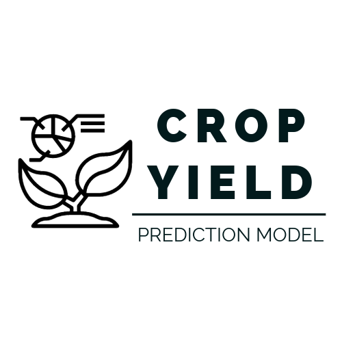

# Crop Yield Prediction Model
Project 4 for Monash BootCamp

    

## 🖥 Project Objetive

The primary goal of predicting crop yield using machine learning is to optimize agricultural production. By accurately forecasting crop yields, farmers and agricultural stakeholders can make informed decisions regarding planting schedules, resource allocation, and crop management practices

## 🧰 Languages and Tools

In this project we outline the tools, language and libraries required to complete the project brief.
 

  
 
 

       

## 🔃 Prediction Model

This repository contains a machine learning pipeline designed to predict crop yields from various agricultural features. The primary model used is a RandomForestRegressor, encapsulated within a scikit-learn pipeline that includes preprocessing steps for both numerical and categorical data. This model is selected for its excellent performance with non-linear data and resistance to overfitting, which makes it an appropriate choice for our dataset that includes various feature interactions.

### <ul>Data Preprocessing</ul>

The crop_yield.csv dataset is preprocessed by removing the state column to avoid biases due to state-specific variations. Numerical features are scaled, and categorical features are one-hot encoded.

### <ul>Model Training and Evaluation</u>

The RandomForestRegressor is trained on the dataset. Model performance is evaluated using the RMSE, MAE, and R-squared score. Predictions are compared with actual yields to assess the model's accuracy.

### <ul>SHAP Value Analysis</ul>

SHAP values are computed to interpret the model's predictions, providing insight into the significance and impact of each feature on the predicted output.

### <ul>Model Evaluation</ul>

The scatter plot of actual vs. predicted yields shows a strong positive correlation, indicating the model's predictive capabilities. The ideal prediction line serves as a benchmark for accuracy.

The prediction error histogram, with a mean error of -3.25 and a median error close to zero, suggests a slight tendency of the model to underestimate the yields, but with a balanced error distribution overall.

## 👨‍💼💻👩‍💼 Collaborators

| 
Contributors
    | 
Github Profile
    |
| ----------------| -------------------------------------- |
| 
Gabriel 
      | https://github.com/gadriano11       |    
| 
Wassim
 |   https://github.com/wdeen             |  
| 
Choon Sien
| https://github.com/sienchoon              |