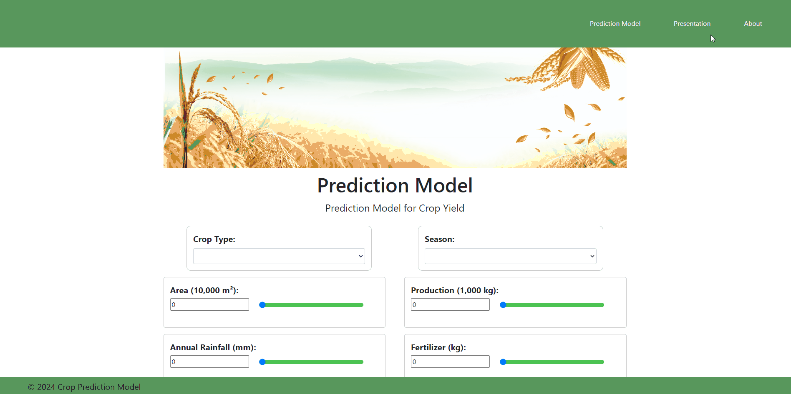

# India: Crop Yield Prediction Model

<p align="center">
    
</p>

# Table of Contents
1. [Project Members](#project-members)
2. [Project Overview](#project-overview)
3. [Application Demo Preview (Final Version)](#application-demo-preview-final-version)
3. [Application Demo Preview (Early Stages)](#application-demo-preview-early-stages)
4. [Final Repository Structure](#final-repository-structure)
5. [Languages and Tools](#languages-and-tools)
6. [Project Workflow](#project-workflow)
7. [Target Audience](#target-audience)
8. [Prediction Model](#prediction-model)
9. [Summary](#summary)


## 👨‍💼💻👩‍💼 Project Members
| <center>Contributors</center>    | <center>Github Profile</center>    |
| ----------------| -------------------------------------- |
| <center>Gabriel Adriano</center>      | https://github.com/gadriano11       |    
| <center>Wassim Deen</center> |   https://github.com/wdeen             |  
| <center>Choon Sien Wong</center>| https://github.com/sienchoon              |


## 🖥 Project Overview
For this project, we utilised the [Agricultural Crop Yield in Indian States Dataset](https://www.kaggle.com/datasets/akshatgupta7/crop-yield-in-indian-states-dataset) to achieve our primary goal of predicting crop yield using machine learning. By accurately forecasting crop yields, farmers and agricultural stakeholders can make informed decisions regarding planting schedules, resource allocation, and crop management practices.


## 📱 Application Demo Preview (Final Version)
<p align="center">

</p>


## 📱 Application Demo Preview (Early Stages)
<p align="center">

</p>


## Final Repository Structure
```
├── README.md
├── .gitattributes
├── 'Images' Folder
├── 'Slide Deck' Folder
├── '.vscode' Folder
├── 'Development' Folder
    ├── 'Flask Development' Folder
    ├── 'ML Development' Folder
    └── 'Web Development' Folder
└── 'Final' Folder
    ├── app.py
    ├── final_crop_yield.csv
    ├── 'templates' Folder
    ├── 'static' Folder
    └── 'pkl' Folder
    
```


## 🧰 Languages and Tools
In this project, we outline the tools, language and libraries required to complete the project brief.
<br>

<p align="center">


</p>

<br>

<p align="center">


 
 
</p>

## ➡️ Project Workflow


Project timeline: 

Project Initiate on 6th February 2024<br>
    - Data Collection and Cleaning<br>
    - Model Training and Evaluation<br>
    - Model Deployment<br>
    - App Deployment
    <br><br>
Project Completion on 19th February 2024<br>
Project Presentation on 20th February 2024


## 👤 Target Audience
<p align="center">
    
</p>


## 🔃 Prediction Model

This repository contains a machine learning pipeline designed to predict crop yields from various agricultural features. The primary model used is a RandomForestRegressor, encapsulated within a scikit-learn pipeline that includes preprocessing steps for both numerical and categorical data. This model is selected for its excellent performance with non-linear data and resistance to overfitting, which makes it an appropriate choice for our dataset that includes various feature interactions.

.png)

### Data Preprocessing

The crop_yield.csv dataset is preprocessed by removing the state column to avoid biases due to state-specific variations. Numerical features are scaled, and categorical features are one-hot encoded.


### Model Training and Evaluation

The RandomForestRegressor is trained on the dataset. Model performance is evaluated using the RMSE, MAE, and R-squared score. Predictions are compared with actual yields to assess the model's accuracy.


### SHAP Value Analysis

SHAP values are computed to interpret the model's predictions, providing insight into the significance and impact of each feature on the predicted output.


### Model Evaluation

The scatter plot of actual vs. predicted yields shows a strong positive correlation, indicating the model's predictive capabilities. The ideal prediction line serves as a benchmark for accuracy.

The prediction error histogram, with a mean error of -3.25 and a median error close to zero, suggests a slight tendency of the model to underestimate the yields, but with a balanced error distribution overall.


## 🔖 Summary 

Ultimately, the objective of developing a crop yield prediction model is to provide farmers and stakeholders with valuable insights that facilitate decision-making processes. By leveraging historical data, real-time information, and advanced analytics, predictive models enable stakeholders to make more informed and strategic decisions throughout the agricultural production cycle.

